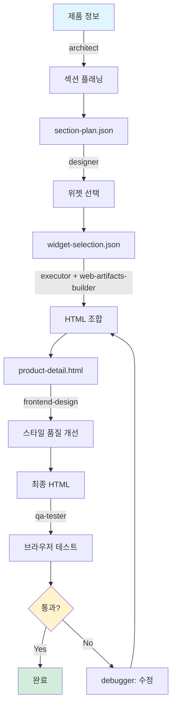
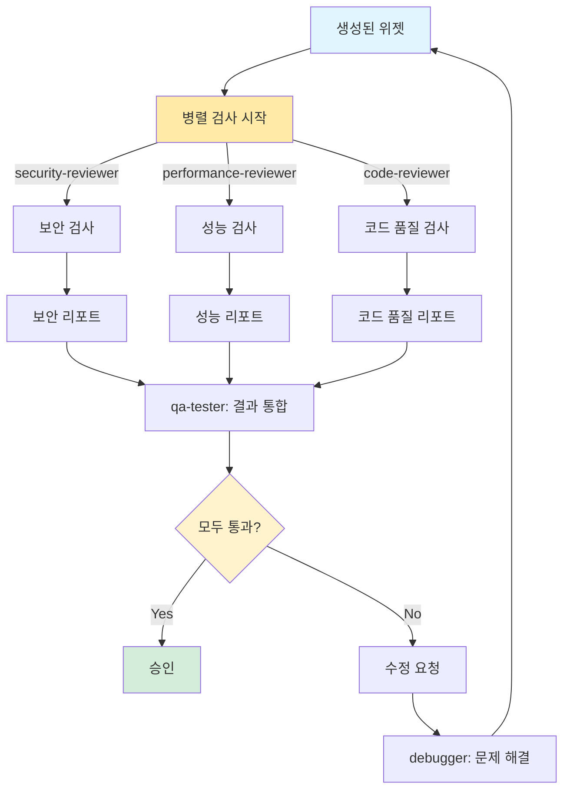
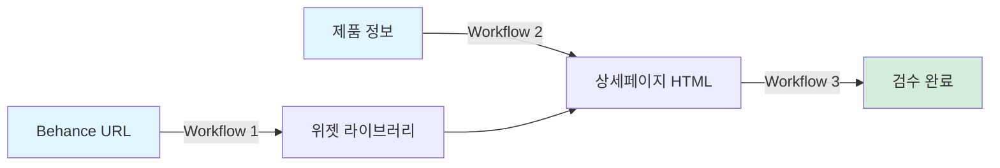
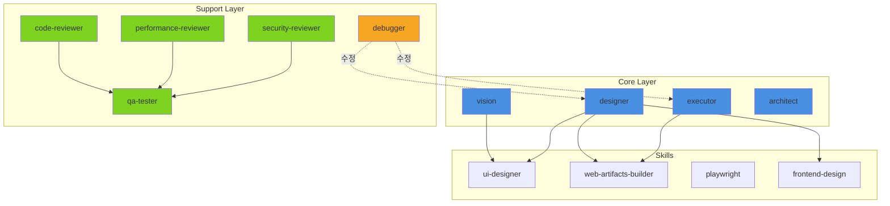
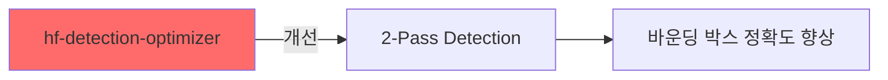
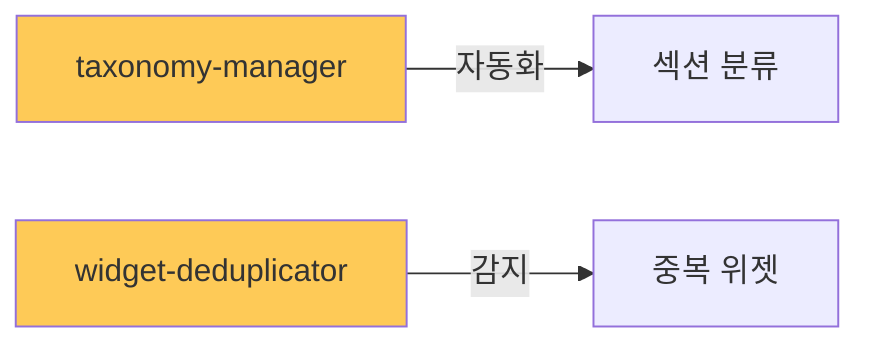
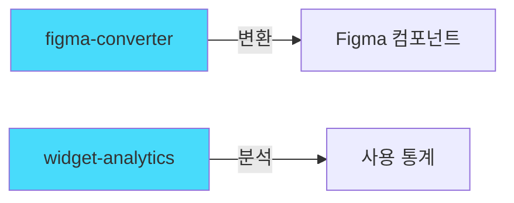

# auto-details 워크플로우

## 1. 레퍼런스 → 위젯 추출 (reference-to-widgets)

```mermaid
graph TB
    A[Behance URL] -->|playwright| B[이미지 다운로드]
    B --> C[references/ 저장]
    C -->|vision| D[이미지 분석]
    D --> E[바운딩 박스 감지]
    E -->|ui-designer| F[디자인 시스템 추출]
    F --> G[preset--ref-{name}.json]
    G -->|web-artifacts-builder| H[위젯 HTML 생성]
    H --> I[*.widget.html 파일들]
    I -->|code-reviewer| J[품질 검증]
    J --> K{통과?}
    K -->|Yes| L[executor: 레지스트리 업데이트]
    K -->|No| M[debugger: 수정]
    M --> H
    L --> N[완료]

    style A fill:#e1f5ff
    style N fill:#d4edda
    style K fill:#fff3cd
```

### 역할 분담

| 순서 | 에이전트 | 스킬 | 책임 |
|------|---------|------|------|
| 1 | - | playwright | Behance 자동 스크래핑 |
| 2 | vision | - | 이미지 초기 분석 및 바운딩 박스 감지 |
| 3 | designer | ui-designer | 디자인 시스템 추출 (색상, 폰트, 간격) |
| 4 | designer | web-artifacts-builder | React + Tailwind로 위젯 HTML 생성 |
| 5 | code-reviewer | - | 시맨틱 HTML, 접근성, 보안 검증 |
| 6 | executor | - | widgets/_registry.json 업데이트 |

**예상 소요 시간**: 15-20분
**병렬 처리**: 불가 (순차 실행)

---

## 2. 제품 → 상세페이지 (product-to-html)



### 역할 분담

| 순서 | 에이전트 | 스킬 | 책임 |
|------|---------|------|------|
| 1 | architect | - | 섹션 구조 설계 및 플래닝 |
| 2 | designer | - | 위젯 레지스트리에서 최적 위젯 선택 |
| 3 | executor | web-artifacts-builder | 선택된 위젯들을 조합하여 HTML 생성 |
| 4 | designer | frontend-design | 고품질 스타일 적용 및 개선 |
| 5 | qa-tester | - | 브라우저 호환성 및 렌더링 테스트 |

**예상 소요 시간**: 10-15분
**병렬 처리**: 불가 (순차 실행)

---

## 3. 품질 검수 (quality-review)



### 역할 분담 (병렬 실행)

| 순서 | 에이전트 | 스킬 | 책임 | 병렬 |
|------|---------|------|------|------|
| 1 | security-reviewer | - | XSS, 인젝션, API 키 노출 검사 | ✅ |
| 1 | performance-reviewer | - | 번들 사이즈, 로딩 속도, 렌더링 성능 | ✅ |
| 1 | code-reviewer | - | 시맨틱 HTML, 접근성, 코드 품질 | ✅ |
| 2 | qa-tester | - | 3개 리포트 통합 및 최종 판정 | ❌ |

**예상 소요 시간**: 5-8분
**병렬 처리**: 가능 (1단계 3개 에이전트 동시 실행)

---

## 통합 파이프라인



### 전체 프로세스

1. **Workflow 1**: 레퍼런스 이미지 수집 및 위젯 추출 (최초 1회 또는 새 레퍼런스 추가 시)
2. **Workflow 2**: 제품 정보를 기반으로 위젯 조합 및 상세페이지 생성 (반복 사용)
3. **Workflow 3**: 생성된 결과물 품질 검수 (자동 또는 수동)

---

## 실행 명령어

### 빠른 명령어

```bash
# Behance 스크래핑
/oh-my-claudecode:team 2:vision,executor "playwright로 Behance URL 스크래핑"

# 레퍼런스에서 위젯 추출
/oh-my-claudecode:team 4:vision,designer,executor "레퍼런스에서 위젯 추출"

# 제품 상세페이지 생성
autopilot: 제품 상세페이지 생성

# 위젯 품질 검수
/oh-my-claudecode:ultrawork "위젯 품질 검수"

# 성능 최적화
ralph: 위젯 성능 최적화
```

### 전체 파이프라인 실행

```bash
# 1단계: 레퍼런스 분석
/oh-my-claudecode:team 5:vision,designer,executor,code-reviewer "
1. playwright로 Behance URL 스크래핑
2. ui-designer로 디자인 시스템 추출 및 preset 생성
3. web-artifacts-builder로 섹션 위젯 HTML 생성
4. code-reviewer로 품질 검증
5. widgets/ 폴더에 저장 및 레지스트리 업데이트
"

# 2단계: 상세페이지 생성
autopilot: 제품명 "비타민C 세럼" 으로 상세페이지 HTML 생성, 스타일은 preset--ref-collagen 사용

# 3단계: 최종 검수
/oh-my-claudecode:ultrawork "output/ 폴더의 모든 .widget.html 파일 품질 검사"
```

---

## 에이전트 의존성 그래프



**범례**:
- 🔵 Core Layer: 핵심 실행 에이전트
- 🟢 Support Layer: 검증 및 지원 에이전트
- 🟡 Debugger: 문제 해결 에이전트
- → 실선: 주요 의존성
- ⋯> 점선: 수정/개선 피드백

---

## 커스텀 에이전트 로드맵

### Phase 1 (우선순위: 높음)



**hf-detection-optimizer**
- HuggingFace Inference API 최적화
- OWL-ViT 모델 파라미터 튜닝
- IoU 매칭 알고리즘 개선
- 타일 오버랩 보정 자동화

### Phase 2 (우선순위: 중간)



**taxonomy-manager**
- section-taxonomy.json 자동 관리
- 새 섹션 타입 추천
- 키워드 자동 추출

**widget-deduplicator**
- 시각적 유사도 계산
- 구조적 유사도 (HTML DOM)
- 자동 병합 제안

### Phase 3 (우선순위: 낮음)



**figma-converter**
- HTML → Figma 자동 변환
- Auto Layout 설정
- 컴포넌트화

**widget-analytics**
- 위젯 성능 추적
- 컨버전율 분석
- 추천 최적화
